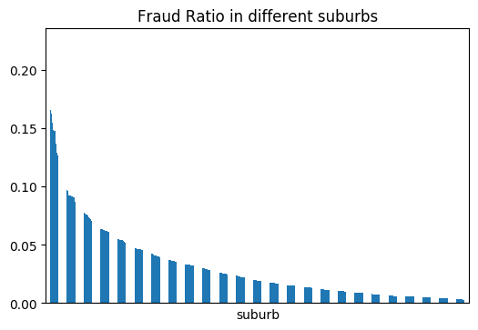
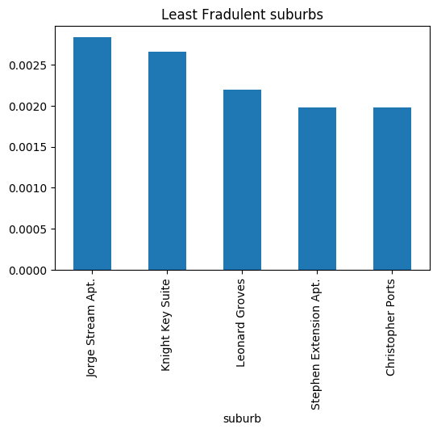
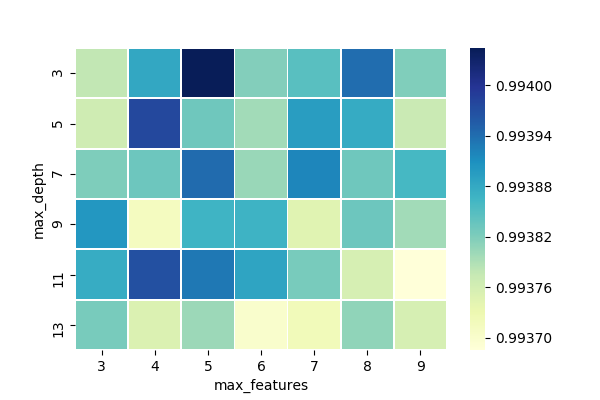

# Insurance fraud detection

### 1. Introduction
Fraud has been plaguing the insurance industry since the beginning of its existence. False claims incur substantial loss for the insurance providers, and they drive up the costs of insurance products for everyone. On the one hand, fraud detection itself incurs costs. If the company develops an accurate fraud detection system but the implementation is time-consuming, expansive or involving the breach of confidentiality of data, it is not of practical use. On the other hand, failure to recognize any frauds is clearly unadvisable. Therefore, investigating an effective model and fraud detection techniques is required to improve the quality of the service and minimize the unnecessary costs. This problem falls into the category of classification in the realm of machine learning.

then you need to briefly mention the methods 

### 2. Expanded literature review

Due to lack of experience and domain knowledge, we realize a comprehensive literature review on fraud detection projects is necessary. In order to get inspired on some similar ideas we read though a dozen of academic papers and we discover the followings are most related. Yi Peng etc. [1] introduced three predictive models: Naïve Bayes, decision tree and Multiple Criteria Linear Programming to be trained, they gave out the test results to compare the accuracy and also proposed some suggestions for future projects on frauds. Capelleveen etc [2] provided the outlier method of data mining technology for the health insurance fraud detection. This is also used for detecting the suspicious behavior of medical service providers. Zhenxing Hou [3] proposed a fraud risk analysis according to cluster analysis for isolation by distance clustering method. Clifton Phua etc [4] conducted a research survey which explored almost all published fraud detection studies and gave a comprehensive overview of different types of fraud, the methods and techniques people used and their limitations. They indicated unsupervised, semi-supervised and text mining from law enforcement approaches for different types of data. 

Jing Li [7] conducted a detailed survey on statistical methods for fraud detection in health care data area. This survey classified the behaviors of fraud cases, identified the sources on which fraud detection has been conducted, provided crucial steps in data preprocessing, compared statistical methods that currently in use, and provided the advice on future directions. Thorton et [8] indicated a multidimensional data model and analyzed important approaches to help predict fraudulent cases. In addition, Weizong Zhang [9] has conducted the single-factor and two-factor analysis by SAS software according to the application of Logist regression model to classify the considerable factors in fraudulent claims. These techniques that have been mentioned above are quite effective and are good references for our own project.

Additionally, Rafael et [10] evaluated the behavior and influence of feature selection methods, performed undersampling strategy to improve the performance and used real data to check the results. The model achieved high efficiency by reducing the number of features. Qi Liu [5] introduced fraudulent behaviors in health care system and analyzed characteristics of dataset, compared and reviewed some existing fraud detection approaches. He also proposed a clustering model that contains information of geo-location to identify dubious claims. Furthermore, Ayhan Demiriz [6] evaluated the value of geographical information for deriving business rules to detect and prevent financial frauds and scams in his paper. These papers inspire us that location information could become one of the significant features. 

In general, the papers suggest and prove that the machine learning techniques are effective and beneficial in detecting fraud activities. They are informative guide and inspiration for our following research.

### 3. Material and methods

#### 3.1 Data Description
Yuumi Insurance provided the log data that records the interaction between the customers and the company. The dataset contains more than 3 million records which enhances the level of difficulty. Each piece of information is structured, timestamped and describes a specific activity of a customer, including quotes, claims and payment status. When a customer enters one of the platforms (mobile app, website or phone calls), a quote will be generated based on the client's information.  

If the client chooses to accept the insurance policy and make a payment, this information is recorded as well, without the specific amount of money the client paid. When a claim is made, the company will look through the client's claim history and examine all the information related to the client and decided if they will accept or deny the claim.

#### 3.2 Data Cleaning
The log data provided by the insurance company has 2 components, the message and the time stamp. Each piece of data has an activity type, including but not limited to: "Quote Started", "Payment Completed", "Claim Started", "Claim Accepted" and "Claim Denied". In reality a customer's claim could be denied for many reasons, but in this dataset "Claim Denied" are precisely the cases that are identified as frauds.

The data is in the log form and therefore should go through data cleaning, data transformation and data curation processes to be in tabular form, on which we build a classifer of fraudulant activities. Challenges encountered with this data include:

* Not all data are relevant. We split the original data according to the activity type. "Quote Completed", "Claim Started", "Claim Accepted" and "Claim Denied" are the most important ones and are examined individually.

* There are several different delimer seperating fields in each piece of data. For example, the case ID, platform and activity type a
These two sub-problems describe two ends of a specturm. In reality, the situaion would fall somewhere in between, depending on how quicky the companies' policies expire. The real-time fraud-detector would have to deal with both cases, the new customers as well as current ones. re separated by "-", whereas the time stamp and the rest of the information is separated by ",".

* Due to confidentiality concerns, the insurance company's clients' information are transfromed and substituted by pseudo names. No meaningful conclusion can be drawn from these names and addresses directly, but the distribution of these data are kept intact. 

* One customer ID could correspond to different payload, in which they submit different information about their households and homes. One customer ID could also submit multiple claims and there is no given link between a "Claim Started" and "Claim Denied" or "Claim Accepted" cases. We will process the data on the assumption that each "Claim Started" case corresponds to the most recent submitted payload from "Quote Completed". The customers with more than one payload and those who submitted more than one claims only constitute a small proportion of all data.

We split the dataset by activity types and label each incoming case. The incoming cases are sorted according to their time stamps. Each incoming case has features attached to it, which are used to predict the label. Other than "platform" (the platform the claimer used), the majority of the features are extracted from the "Quote Completed" data, where the customers submitted Json payload describing their demographic and household information.

We extracted an important feature not in the original data, which is "matched_time_stamp". From our observations, many claims were started right after the customer made the payment, mostly the fraudulent ones. The time stamps are exactly the same. "matched_time_stamp" simply checks if there is a "Payment Completed" activity associated with the same customer ID, at the exact same time a "Claim Started" activity happened. Our analysis validates that all of the frauds have this feature equalling "True", but not the other way around. There are still some cases with matched time stamps but are not labelled as "Fraud".

#### 3.2 Definition of Problem
Since the time-span of this dataset is not very long, most claims are made by existing customers(those already in the company's database). In the short run, these claims are prevelant as the customers' insurance policies hasn't expired yet ,with new customers coming in slowly. However, in the long run, customers will come and go, and claims made by new incoming customers deserve special attention, as their claim history is unknown. Therefore, this reprot aim to solve 2 sub-problems of insurance fraud deteciton: 

1. Given all the predictors including the claim history of each customer, predict as accurate as possible whether or not an incoming claim is fradulent.

2. Treat each customer as a new customer and try to predict whether or not an incoming new case is fradulent.

These two sub-problems describe two ends of a specturm. In reality, the situaion would fall somewhere in between, depending on how quicky the companies' policies expire. The real-time fraud-detector would have to deal with both cases, the new customers as well as current ones. 

#### 3.2 Assumptions
The following assumptions are made on this dataset:

1. One customer ID can only represent one customer in real life. In the dataset, one customer ID could correspond to a lot of activities. One customer ID could even have different Json payloads (with claimer's name, age, gender and other basic information). In reality, most companies would not reuse its customer IDs as this creates unnecessary anomolies and inconsistencies. Therefore, in our analysis, each customer ID is treated as an individual customer.

2. For the majority of the customers, their identities do not change over time. We assume that most normal customers would never start any fraudulent activities, at least not under the same customer ID. We also assume that most frauds would not turn from their wrongdoings and start making legitimate claims, at least not under the same ID. This assumption can be validated through the following analysis:

different platforms have different fraud ratios 

3. The occurrence o

different platforms have different fraud ratios 

 This means that the information associated with a c

different platforms have different fraud ratios 

As shown in the pie

different platforms have different fraud ratios 

stomers whose claims got denied and accepted at differe

different platforms have different fraud ratios 

mall proportion of the population. For the rest of the custome

different platforms have different fraud ratios 

ed or always got accepted.

// there should be 

different platforms have different fraud ratios 

Based on assumption 2, if an existing customer makes a new claim, the claim history tells us a lot about whether the incoming claim is fraud or not. We define an additional feature for each incoming claim case, "number of denials". For each claim case along with a time stamp, this feature shows how many times a customer's claims got denied by that time stamp. For example, if a person got denied 5 times (although this is unlikely in the dataset), the "number of denials" for the 5 incoming cases should be 0,1,2,3,4, indicating how many times the person were denied already.

#### 3.3 Methods

A classification model is appropriate for this dataset since the incoming cases have 2 labels, fraud or normal. Based on the original features and 2 extracted ones, classifiers are built to predicts the label of incoming claims. An approach widely adpoted is to split the data into training, testing and validation sets. The training set is used to build the classifier and the validation set will evaluate the performance of the model. Looking at performance metrics of the classifier on the validation set can help identify the most relevant features and combination of parameters of the classifier. After obtaining the most important features and the optimal combination of parameters, a final model is built on training and validation sets, and evaluated on the test set.

Often the testing set is set aside in advance, and cross validation technique is applied to the rest of the data. The remainder of data is split into K even shares. Each share is used as the validation set in each iteration.

However, cross validation cannot be applied when solving subproblem 1 (claim history considered and data sorted by time). The reason is two-fold:

1. Every case is time-stamped. Cross validation means at some point a classifier using data in the future is built to predict labels in the past. There could be some information leak from the future to the past that makes the classifier perform better than it should be. For example, if some feature is dependent on past labels, then the value of such features in the future already include the information about labels in the past, which is precisely the case with a extracted feature in our model, "number of denials".

2. Even if there is no risk of information leak when doing cross validation, we cannot make the assumption that time does not play a part in the pattern in which fraudulent activities occur. No prior knowledge or evidence is available to make such assumption.

If parameter-tuning is needed for modelling in subproblem 1, the predefined performance metrics can be calculated on different split ratios.

When considering subproblem 2, the claim history of each customer is not considered. Based on assumption 3, it does not matter when does a customer come into the database. As time is taken out of the equation, cross validation can be used for parameter-tuning of models, evaluation of models and selection of features. The abovementioned procedures to train a classification model are done in the solution of subproblem 2. 

As for the classification algorithm, Decision tree and Random-Forest are adpoted because it's convenient to conduct feature selection with them. Random-Forest is basically a collection of randomly generated decision trees. Decision Tree are non-parametric supervised learning algorithm. It doesn't require much preprocessing of the data and deals well with missing values. A decision tree is a set of rules that split the dataset into different subsets(called leaves). Each time the tree splits the data in current node by one of the attributes. The tree does not stop splitting the dataset unless prior restriction is given and met. Conventionally, decision trees are grown and then pruned to a smaller depth to avoid overfitting. Despite the "max depth", "max number features" or "min leaf node" constraints set to overcoming overfitting in decision trees, one single tree tends to bring in too much bias into the model. As Random-forest takes the average "opinion" of many randomly generate trees, its predictions have less bias, lower variance and more consistent. 

### 4. Analyses and Results

#### 4.1 Feature Engineering
Explorative data analyis is conducted on the features. For categorical variables, the data is by the variable and check if the proportions of fraudulent claims are similar. "Fraud ratio" illustates what percentage of claims in one category are frauds. If across different categories the "fraud ratio" varies dramatically, then it is probable that such variable is relevant to fraud detection.

The first variable examined is suburb, as related literature has reported that this is generally relevant to fraud detection.

The above plot shows that fraud ratio vary a lot across different suburbs. In some suburbs, as many as 20% of the claims are fraudulent, whereas in the other suburbs almost all claims are legitimate. The distinction is furthere depicted in the following tww graphs. The left list the suburbs with the highest fraud percentages and the right list the suburbs with the lowest fraud ratios. 
|1|2|
| ------------- | ------------- |
| |  

The variable "platform" refers to the platform the customer used to make a claim to the insurance company. Platforms include "Mobile APP", "PC Browser", "Mobile Browser" and "Phone Call". 

As shown above, the fraud ratios across different platforms are not alike. A noteble point is that there is no fraudulent claims via phone calls. All of the claims made via phone calls are legitimate. It would be beneficial to include "platform" in the model.

#### 4.2 Modelling and Results

The labels in this data is really imbalanced. Therefore, accuracy alone does not reflect the performance of a classifier. 

useful references
https://www.sciencedirect.com/science/article/pii/S0020025511006773
